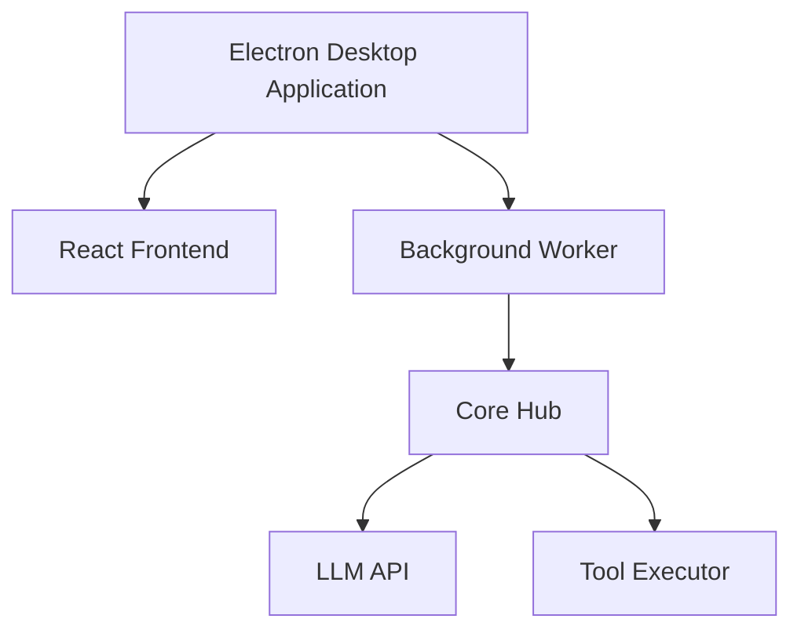

# Auto Machine - Desktop AI Intelligent Assistant

[中文版本](./readme_zh.md)


**Making AI Assistant Truly Accessible**
An AI Agent built on Electron, supporting integration with OpenAI/Gemini/deepSeek/Anthropic and other large language models. One-click installation, no development environment configuration needed, letting AI liberate productivity.

------

## Core Advantages

### One-Click Installation Experience

- **Standalone Desktop Application**: Built on Electron, providing cross-platform support
- **Zero Configuration Startup**: No environment dependencies or development toolchain required

### Intelligent Interaction Innovation

- **YAML-Driven Toolbox**: Define tool execution logic through standardized format, supporting real-time debugging and auditing
- **Progressive Context Management**: Dynamically load prompt fragments, obtaining key information as needed

### Ready-to-Use Capabilities

- **Intelligent File System Operations**: Support for local file creation, deletion, modification, querying, and automated processing
- **Browser Automation Control**: Web content scraping, form filling, process automation
- **Multi-Step Task Planning**: LLM-based autonomous task decomposition and path optimization

------

## Technical Architecture

mermaid

Copy



------

## Working Principle

1. **Task Parsing**
    AI understands the tool library (file operations/browser control, etc.) through a streamlined initial prompt
2. **Intelligent Decision Making**
    Generates standardized YAML execution instructions:

yaml

Copy

```yaml
tool: file
cmd: download
url: https://www.baidu.com/favicon.ico
path: ./download/favicon.ico
```

3. **Dynamic Execution**
    Backend parses and executes instructions, execution results are fed back in structured format
4. **Continuous Optimization**
    Automatically adjusts strategy based on execution logs, supporting up to 5 iterations of optimization

------

## Solution Comparison

| Feature           | Auto Machine | Traditional Solutions |
| ----------------- | ------------ | --------------------- |
| Installation Complexity | ⭐            | ⭐⭐⭐⭐                |
| Token Efficiency  | ⭐⭐⭐⭐⭐        | ⭐⭐                    |
| Interaction Friendliness | ⭐⭐⭐⭐⭐        | ⭐⭐                    |
| Environment Dependencies | None         | Python/Node          |
| Learning Curve    | 15 minutes   | 2+ hours              |

---

# Recent Iterations

- [x] Core Architecture Refactoring
- [x] Intelligent Planning System
- [ ] Custom Task Templates
- [ ] Multi-agent Support

------

## 🤝 Help Auto Machine Grow

[](https://github.com/waht41/auto_machine/stargazers)

[](https://github.com/waht41/auto_machine/releases)

👉 [Get the Latest Version Now](https://github.com/waht41/auto_machine/releases)  

💡 Having issues? [Submit an Issue](https://github.com/waht41/auto_machine/issues) 
