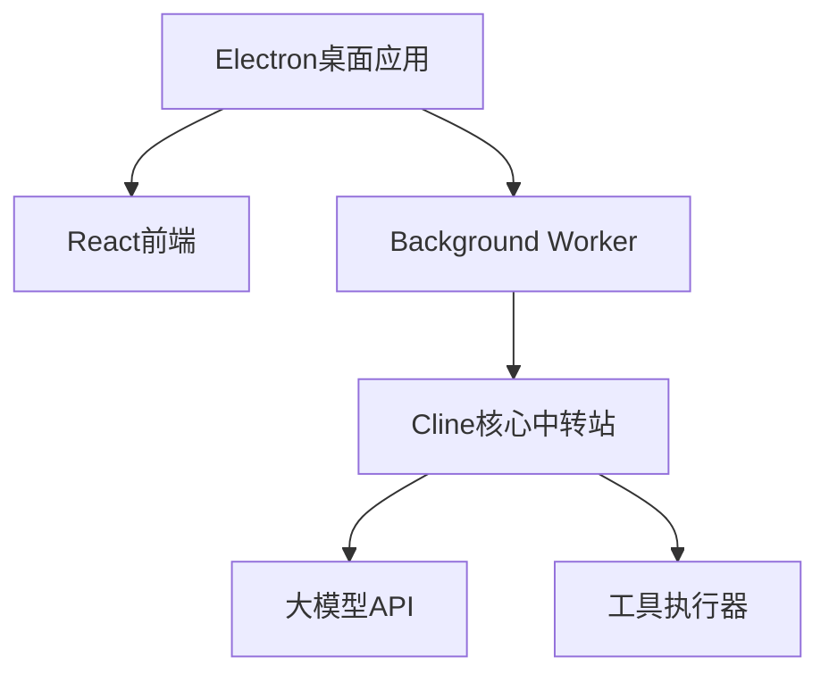

# Auto Machine - 桌面AI智能助手


**让AI助手真正触手可及**  
一款基于Electron构建的桌面智能代理，通过大模型实现复杂任务的自动化处理。无需开发环境配置，让AI解放生产力。

## 🚀 核心优势

### 一键安装体验

• 独立桌面应用（基于Electron）

• 摆脱Python环境依赖

• 无需繁琐的配置

### ⚡ 智能交互革新

• **YAML驱动的工具箱**：人类与AI的信息交流桥梁

• **渐进式上下文**：按需获取信息，动态prompt加载

### 🛠️ 开箱即用的能力

• 文件系统智能操作

• 浏览器自动化控制

• 多步骤任务规划（开发中）


## 🌐 技术架构



## 🧠 工作原理

1. **任务解析**  
   AI通过精简的初始prompt理解工具库（文件操作/浏览器控制等）

2. **智能决策**  
   基于YAML格式生成可执行指令：

```yaml
tool: file
cmd: download
url: https://www.baidu.com/favicon.ico
path: ./download/favicon.ico  # 保存到当前目录下的download文件夹中
```

3. **动态执行**  
   后台解析指令并执行，结果实时反馈给AI

4. **持续迭代**  
   根据执行结果自主调整策略，直至任务完成

## 🌟 为什么选择Auto Machine？

| 特性       | Auto Machine | 传统方案    |
| ---------- | ------------ | ----------- |
| 安装复杂度 | ⭐            | ⭐⭐⭐⭐        |
| Token效率  | ⭐⭐⭐⭐⭐        | ⭐⭐          |
| 交互友好度 | ⭐⭐⭐⭐⭐        | ⭐⭐          |
| 环境依赖性 | 无           | Python/Node |
| 学习曲线   | 15分钟       | 2小时+      |

## 🛣️ 发展路线

### 近期迭代

- [x] 核心架构重构
- [ ] 智能规划系统
- [ ] 自定义任务模板
- [ ] multi-agent支持

## 🤝 加入Auto Machine

[](https://github.com/waht41/auto_machine/stargazers)
[](https://github.com/waht41/auto_machine/releases)

👉 [立即获取最新版本](https://github.com/waht41/auto_machine/releases)  

💡 遇到问题？[提交Issue](https://github.com/waht41/auto_machine/issues) 加入技术讨论

---

📌 **开发者提示**：支持OpenAI/Gemini/deepSeek以及本地大模型接入，自由定制属于您的智能工作伙伴！
