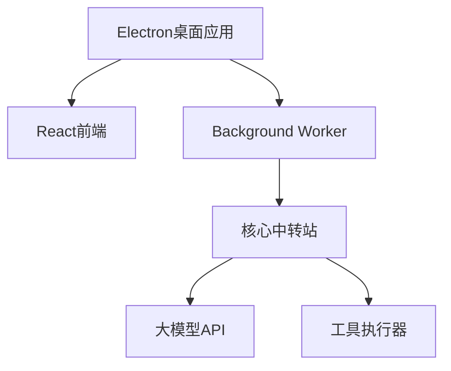

# Auto Machine - 桌面AI智能助手

**让AI助手真正触手可及**
 一款基于Electron构建的AI Agent，支持OpenAI/Gemini/deepSeek/Anthropic等大模型接入。一键安装，无需配置开发环境，让AI解放生产力。

------

## 核心优势

### 一键安装体验

- **独立桌面应用**：基于Electron构建，提供跨平台支持
- **零配置启动**：无需环境依赖与开发工具链

### 智能交互革新

- **YAML驱动的工具箱**：通过标准化格式定义工具执行逻辑，支持实时调试与审计
- **渐进式上下文管理**：动态加载prompt片段，按需获取关键信息

### 开箱即用能力

- **文件系统智能操作**：支持本地文件的增删改查及自动化处理
- **浏览器自动化控制**：网页内容抓取、表单填写、流程自动化
- **多步骤任务规划**：基于LLM的自主任务分解与路径优化

------

## 技术架构

mermaid

复制



------

## 工作原理

1. **任务解析**
    AI通过精简的初始prompt理解工具库（文件操作/浏览器控制等）
2. **智能决策**
    生成标准化的YAML执行指令：

yaml

复制

```yaml
tool: file
cmd: download
url: https://www.baidu.com/favicon.ico
path: ./download/favicon.ico
```

1. **动态执行**
    后台解析指令并执行，执行结果通过结构化格式反馈
2. **持续优化**
    根据执行日志自动调整策略，支持最多5次迭代优化

------

## 方案对比

| 特性       | Auto Machine | 传统方案    |
| ---------- | ------------ | ----------- |
| 安装复杂度 | ⭐            | ⭐⭐⭐⭐        |
| Token效率  | ⭐⭐⭐⭐⭐        | ⭐⭐          |
| 交互友好度 | ⭐⭐⭐⭐⭐        | ⭐⭐          |
| 环境依赖性 | 无           | Python/Node |
| 学习曲线   | 15分钟       | 2小时+      |

---


# 近期迭代

- [x] 核心架构重构
- [x] 智能规划系统
- [ ] 自定义任务模板
- [ ] multi-agent支持

------

## 🤝 助力Auto Machine成长

[](https://github.com/waht41/auto_machine/stargazers)

[](https://github.com/waht41/auto_machine/releases)

👉 [立即获取最新版本](https://github.com/waht41/auto_machine/releases)  

💡 遇到问题？[提交Issue](https://github.com/waht41/auto_machine/issues) 
